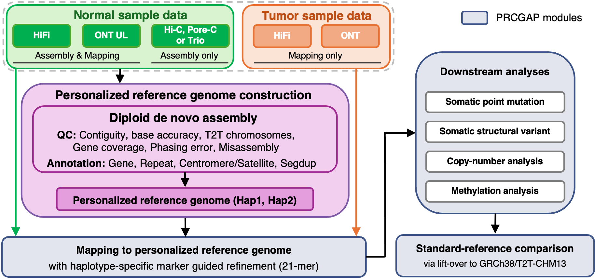

# PRCGAP

**P**ersonalized **R**eference genome-based **C**ancer **G**enome **A**nalysis **P**ipeline

PRCGAP is a Snakemake-based workflow for comprehensive analysis of cancer genomes
using long-read sequencing data (PacBio HiFi and Oxford Nanopore), based on
a personalized diploid reference genome. It covers read alignment, somatic point mutation and structrural variant calling, copynumber analysis, methylation calling, and a rich
annotation chain.

## Documentation

Extensive documentation describing how to set up and run PRCGAP — including
prerequisites, installation, sample sheet format, configuration, cluster execution,
output layout, and container images — is available in the online documentation:

📖 **[Full documentation](https://yos-sk.github.io/prcgapdoc)**

- 🚀 **[Quick start](https://yos-sk.github.io/prcgapdoc/QuickStart)** — install the
  container images, fetch the references and configure a first run
- ⚙️ **[Options](https://yos-sk.github.io/prcgapdoc/Options)** — every
  `setup_workflow.py` flag and config key

## Example

[`test/HG008/test_configure.sh`](test/HG008/test_configure.sh) configures the
reference test case: a HG008 tumor/normal pair with both HiFi and ONT reads, cut
down to chr20 so a complete run finishes in a couple of hours. It is the shortest
worked example of a real configuration, and
[`test/HG008/resources/scripts/README.md`](test/HG008/resources/scripts/README.md)
lists how each input is obtained.

## Citation
Sakamoto Y, Ochi Y, Kogure Y, Kato S, Sato-Otsubo A, Sugawa M, Tanaka Y, Tsujimura T, Mikami T, Nagae G, Chiba K, Okada A, Ito Y, Suzuki H, Aburatani H, Koga Y, Kato I, Takita J, Mano H, Ogawa S, Kataoka K, Kato M, Shiraishi Y. Personalized reference genome-based pipeline reveals comprehensive haplotype-resolved views of cancer genomes. bioRxiv. 2026. doi: 10.64898/2026.05.28.728591